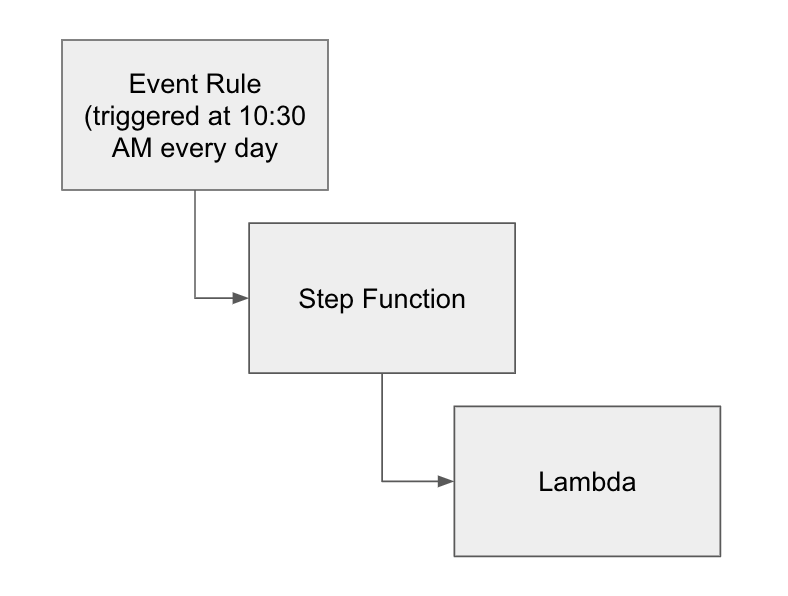

# Pulumi Step Functions
For the sake of learning Pulumi, this simple repo will create the following workflow:

The event rule is triggered based on a crontab, which calls the step function, which calls the Lambda function. The lambda
function just prints a message to stdout.

## Requirements
- `pulumi`

## Environment Setup
Create a Python virtual env:
```shell
pyenv install 3.10.4
pyenv virtualenv 3.10.4 pulumi-step-functions
pyenv activate pulumi-step-functions
```

Then, install the dependencies:
```shell
pip install -r requirements.txt
```

## Deployment
Make sure you have programmatic access to AWS, and your credentials are correct:
```shell
export AWS_REGION=<AWS_REGION>
export AWS_ACCESS_KEY_ID=<AWS_ACCESS_KEY_ID>
export AWS_SECRET_ACCESS_KEY=<AWS_SECRET_ACCESS_KEY>
```

To deploy the infrastructure, run:
```shell
bash run
```

The script will create the lambda package, invoke Pulumi to create
the entire infrastructure and then clean up files from the package generation.

The output will be similar to this:
```shell
...
Outputs:
  + event_rule_{}_{}: "pulumi-step-functions"
  + lambda          : "pulumi-step-functions-lambda"
  + step_function   : "arn:aws:states:eu-west-1:123456789:stateMachine:pulumi-step-functions-step-function"

Resources:
    + 7 created
    4 unchanged

Duration: 13s

run: [INFO] Infrastructure deployed
run: [INFO] Cleaning up lambda package...
run: [INFO] Lambda package cleaned up
```

## What will be deployed?
Pulumi will create the following resources:
- 2 IAM Roles: the first will be used by the lambda function to push logs to CloudWatch, and the second
will be used by the step function
- Lambda function: function that prints a message in the output
- Step Function: function that will trigger Lambda based on a schedule
- Even Rule: (cron) schedule that will trigger the step function

## Deleting Infra
To delete the infra, run:
```shell
pulumi down
```
